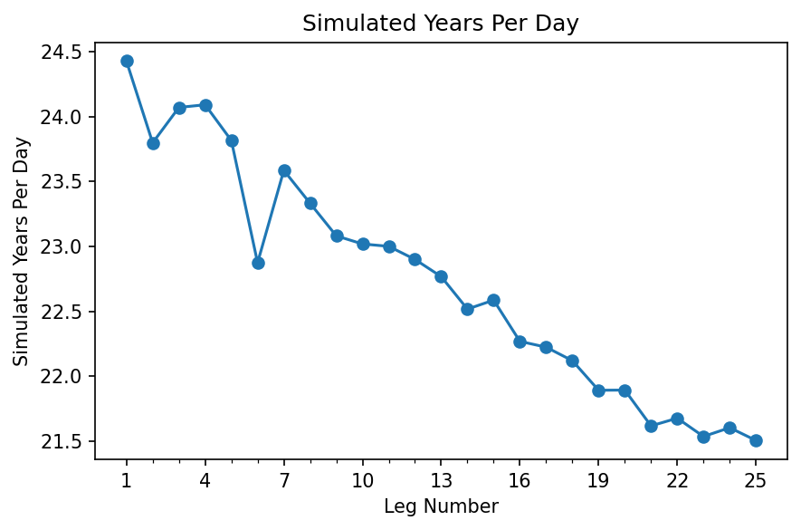

# EC-Earth 4: Computational Performance Monitoring

**Experiment ID**: MO10 

**Experiment Description**: A monitoring test with EC-Earth4 

**Simulated Years**: 25 
Current number of simulated years. 

**Disk Usage in GB**: 432.1 
Current size of /home/sm_uflad/Projects/ece-4/runtime/se/run/MO10/output. 

## Simulated Years Per Day

SYPD development during this simulation.

