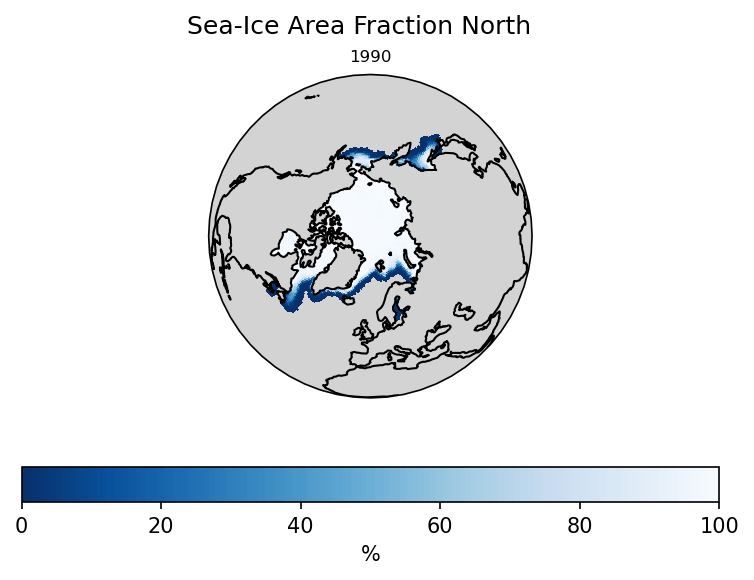
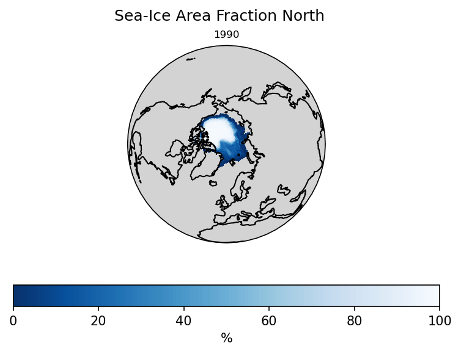
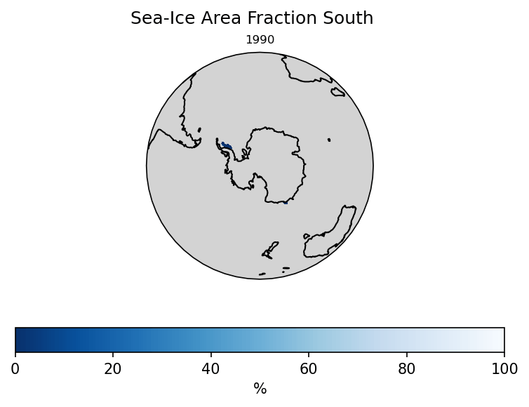
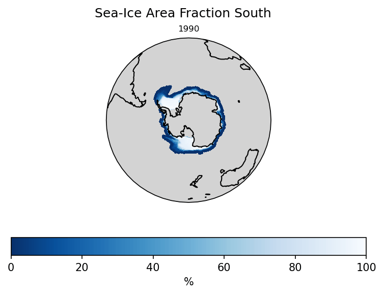

# EC-Earth 4: Monitoring

**Experiment ID**: MO10 

**Experiment Description**: A monitoring test with EC-Earth4 

**Simulated Years**: 25 
Current number of simulated years. 

## Sea-Ice Area (Seasonal Cycle)

")

Sum of Sea-Ice Area / **siconc** on northern hemisphere.

## Sea-Ice Area (Seasonal Cycle)

")

Sum of Sea-Ice Area / **siconc** on southern hemisphere.

## Sea-Ice Volume (Seasonal Cycle)

")

Sum of Sea-Ice Volume / **sivolu** on northern hemisphere.

## Sea-Ice Volume (Seasonal Cycle)

")

Sum of Sea-Ice Volume / **sivolu** on southern hemisphere.

## Sea-Ice Area Fraction North March

Sea-Ice Area Fraction / **siconc** on northern hemisphere.

## Sea-Ice Area Fraction North September

Sea-Ice Area Fraction / **siconc** on northern hemisphere.

## Sea-Ice Area Fraction South February

Sea-Ice Area Fraction / **siconc** on southern hemisphere.

## Sea-Ice Area Fraction South September

Sea-Ice Area Fraction / **siconc** on southern hemisphere.

## Sea-Ice Volume Per Area North March (Climatology)

")

Simulation Average of Sea-Ice Volume per Area / **sivolu** on northern hemisphere.

## Sea-Ice Volume Per Area North September (Climatology)

")

Simulation Average of Sea-Ice Volume per Area / **sivolu** on northern hemisphere.

## Sea-Ice Volume Per Area South February (Climatology)

")

Simulation Average of Sea-Ice Volume per Area / **sivolu** on southern hemisphere.

## Sea-Ice Volume Per Area South September (Climatology)

")

Simulation Average of Sea-Ice Volume per Area / **sivolu** on southern hemisphere.

